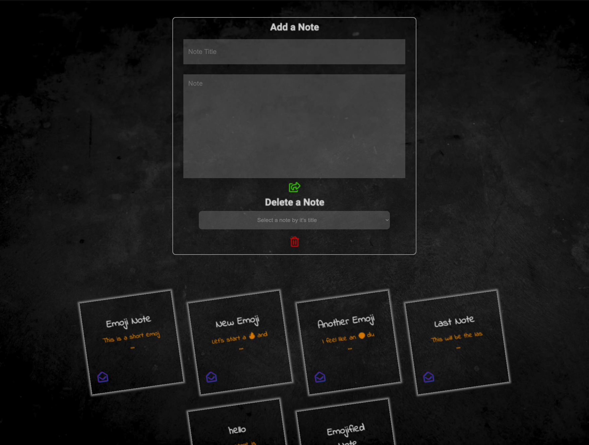
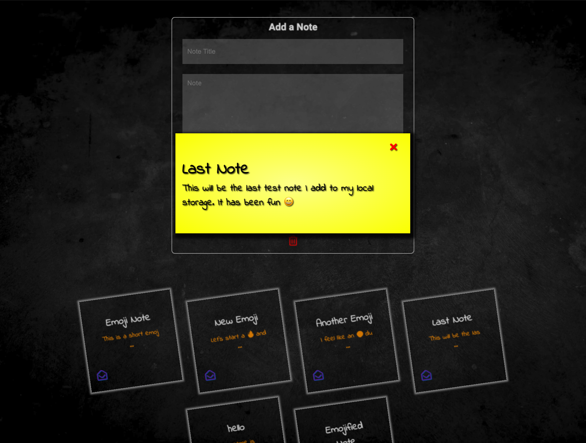

# Notes - One Page App

## User Stories

As a programmer 
I can see a list of my notes, where each note is abbreviated to the first 20 characters 
So I can find the one I want 

As a programmer 
I can create a new note 
So I can record something I need to remember 

As a programmer 
I can see the full text of an individual note on its own page 
So I can see all the information in the note 

As a programmer 
I can use shortcodes like `:fire:` that get converted into emojis like 🔥 
So I can record notes with fun little pictures 

#### Bonus

As a programmer 
I can refresh the page and still see my notes 
So I can remember what I took down 

## Build Status

* Initially created the repo, added collaborators and created the README.
* Local storage has now been implemented.
* Notes can be added and deleted.

## Code style

* CRC cards to determine the classes and responsibilities
* All notes will be stored locally. Local storage must be researched
* No testing frame work will be used. Test will be written using vanilla JavaScript

## Installation

* Open the HTML in your browser.

## Tests

* It tests the Emojify, DisplayNote and Notes classes.

## Technology Used / Dependencies

* HTML
* JavaScript
* CSS

#### Software

* VS Code
* Zoom

## Screenshots

## Credits

* Arif Ebrahim
* Willoughby Hood
* JP Ferreira